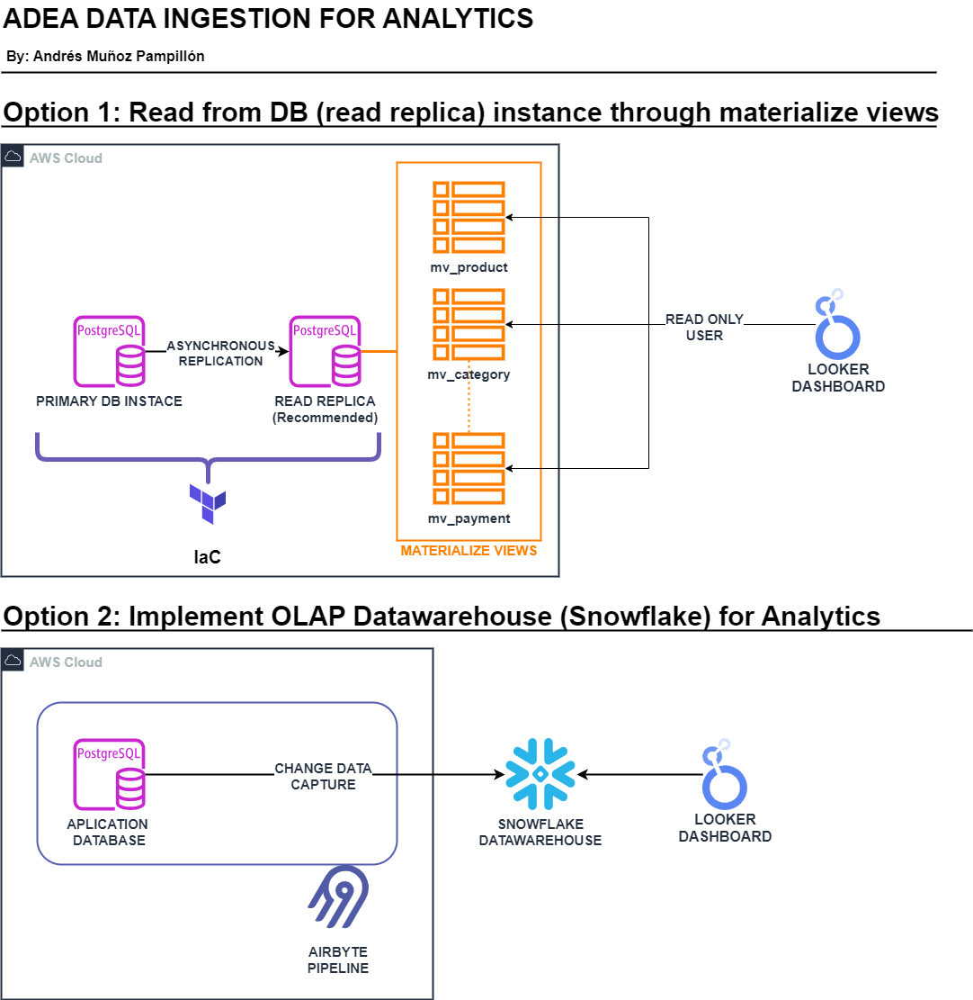

# PROVEER DATOS PARA ANÁLISIS Y BI DESDE SISTEMA DE GESTIÓN DE VENTAS

## ABSTRACTO

El siguiente trabajo busca explorar y desarrollar posibles soluciones para el problema planteado. Teniendo en cuenta diferentes opciones. Realizando un análisis de las virtudes y desventajas de cada opción.

## DESCRIPCIÓN

La empresa ha desarrollado un Sistema de Gestión de Ventas que permite administrar de manera integral a sus clientes, productos, órdenes de venta, facturación y pagos. Con la información contenida en la base de datos operacional, 
se necesita generar un dashboard que permita visualizar los siguientes indicadores.

## REQUERIMIENTO DE DISEÑO

*Es importante señalar que, para optimizar el rendimiento del sistema, se recomienda evitar consultas en tiempo real directamente sobre la base de datos operativa.*

## OPCIÓN 1: Utilización instancias de lectura en la base de datos junto a vistas materilizadas

En esta primera opción se propone como posible solución la utilización de vistas materializadas en conjunto de replicas de lectura (recomendadas) para la ejecución de queries por herramientas de visualización.

### Componentes clave

A continuación se listan los componentes claves de esta opción:
- **Réplica de lectura:** La implementación de una instancia de la base de datos como réplica de lectura puede ser altamente útil. Estas réplicas permiten tener una copia asincrona de la instancia principal.
Donde solo se pueden ejecutar consultas de lectura (select statement). Esto permite leer y realizar lecturas de datos, con altas cargas de trabajo sin interferir con los procesos que requieran leer o escribir información por la aplicación del sistema de gestión de ventas.
Como ventaja extra, estas réplicas pueden ser utilizadas para extraer snapshots como backup.
- **Vistas materializadas:** Las vistas materializadas funcionan precalculando y almacenando los resultados de una consulta específica como una tabla física en la base de datos.
Por lo que sí hay una consulta recurrente, que requiere analizar una gran cantidad de datos, de forma repetida sin necesidad de obtener los datos recién actualizados (ej: Leer una tabla mediante un dashboard); es recomendable utilizarlas.
De esta forma cada vez que se accedan a los datos a través de la vista materializada, la instancia de la base de datos no tendrá que realizar ningun calculo, sino que simplemente leerá los datos almacenados asociados a dicha consulta.
- **Cron job:** Las vistas materializadas tienen la ventaja de su rapidez para retribuir datos, la desventaja es que dichos datos no tienen porqué estar actualizados. Ya que estas guardan una captura física de la información al ser creadas.
Para actualizar dicha información es necesario refrescar la consulta, es decir, volver a ejecutar la query asociada. Este proceso puede hacerse de forma manual o mediante la utilización de cron job. Los cuales ejecutarán el comando de refresh para el periodo establecido.

### Virtudes

A continuación se mencionan ventajas de esta opción:
- Costos reducidos, esta solución no requiere nueva infraestructura ni realizar inversiones.
- Despliegue inmediato ya que el tiempo requerido para configurar y preparar la base de datos es mínimo.
- No es necesario adquirir nuevos conocimientos, ni contratar personal especializado. La configuración de las vistas materializadas puede ser realizada por el DBA actual.

### Desventajas

A continuación se citan algunos aspectos a tener en cuenta:
- Difícil integración, ya que la posibilidad de incluir datos de otras fuentes puede suponer un trabajo complejo.
- El trabajar con una base de datos puede suponer una escalabilidad limitada.
- Uso de arquitectura OLTP para analitica. Las bases de datos por su naturaleza están diseñadas para procesar rápidas y cortas transacciones en vez de largas y complejas consultas.

### Demo

En este caso se decidió deplegar una base de datos en la nube de AWS utilizando el servicio RDS, simulando la posible base de datos utilizada por el sistema de gestión de ventas.

Para ello se utilizó [terraform](postgres-rds-db/terraform/) para desplegar la infraestructura. En este caso se optó por utilizar Postgres 14.

Para ello se generaron datos utilizando python, véase [fake-data](fake-data/). En el [notebook](fake-data/FakeDataCreator.ipynb) se utilizaron diferentes librerías como (faker, random y pandas) para crear Dataframes que semejen a los datos de cada tabla. 
Para después exportar estos dataframes a archivos `.csv`.

Una vez los archivos `.csv` y la base de datos postgres en RDS están listos se procedió a trabajar en la base de datos.

Tal como se explica en las [instrucciones](postgres-rds-db/Readme.md) los pasos realizados fueron.
- Conexión a la instancia RDS y creación de la base de datos.
- Ejecutar el [script_schema](db-files/schema.sql) para crear las tablas solicitadas.
- Insertar los datos en las tablas, importando desde los archivos `.csv` usando el [script_data](db-files/data.sql).
- Crear vistas materializadas de las tablas usando [script_mv](db-files/mv.sql).
- Ejecutar [script_bi_user](db-files/bi_user.sql), creando un usuario postgres con acceso de solo lectura a las vistas materializadas.
- Definir y agendar los cron job para la actualización de las vistas materializadas ejecutando [script_cron_job](postgres-rds-db/cron_job.sql).

## OPCIÓN 2: Desarrollar e implementar un datawehouse

Como segunda propuesta, se plantea la posibilidad de implementar un Datawehouse. En este caso se decidió optar por Snowflake. Donde a través de una herramienta como Airbyte se realizará el proceso de "change data capture".

## Componentes clave
Algunos puntos claves de esta propuesta son:
- Utilizar la base de datos como punto de partida, siendo los datos de esta la base del datawarehouse.
- Utilización de una herramienta como Airbyte para capturar los datos actuales como tambien los cambios realizados en la base de datos, y reflejar los mismos en el datawarehouse. Siendo este proceso por lotes cada cierto periodo.
- Datawehouse como núcleo de datos. Utilizando Snowflake como punto central donde todos los datos (tanto internos como externos) seran puestos a disposición para su consumo por herramientas, diferentes procesos y equipos.

### Virtudes

A continuación se mencionan ventajas de esta opción:
- Fácil integración con numerosas fuentes de datos, los Datawehouses y en especial Snowflake permiten incluir de forma sencilla datos de diferentes fuentes.
Tanto internas de la empresa como de terceros. Además de poder realizar consultas sobre datos estructurados y semi-estructurados.
- La implementación de un datawehouse puede ser el punto de partida para nuevos procesos, abriendo nuevas posibilidades a mejorar y desarrollar sistemas mas complejos de analítca, business inteligence y machine learning.
- La plataforma Snowflake principalmente permite trabajar con SQL, lo cual en equipos con habilidades en este lenguaje suele suponer una ventaja.
- La naturaleza OLAP de los Datawehouse les permite soportar, y ejecutar de manera rápida y eficaz consultas que requieran un gran computo, con elevada complejidad sobre grandes volúmenes de datos.
- La utilización de infraestructura orientada permite separar los procesos relacionados con la aplicación del resto. Aislando la carga de trabajo realizada por la base de datos.

### Desventajas

A continuación se citan algunos aspectos a tener en cuenta:
- Nueva infraestructura implica nuevos costos. Por lo que la inversión debe ser analizada y se debe realizar un cálculo de costos tanto del Datawarehouse como de las herramientas que lo acompañen.
- Necesidad de nuevas herramientas y procesos. Herramientas como Airbyte para "data ingestion" implican mayor complejidad. Lo cual requiere un equipo de Data Engineering. Sobre todo cuando se agregan herramientas complementarias como DBT para la transformación de datos en Snowflake.
- La implementación de un Datawarehouse puede traer consigo nuevos problemas como gobernanza de datos, seguridad, optimización, sobre-aprovisonamiento.

## EVALUACIÓN FINAL

Es claro que ambas posibilidades traen grandes beneficios, con marcadas diferencias una sobre la otra. Ofreciendo cada una diferentes aproximaciones a una problemática.
La decisión de optar por alguna de las dos deberá ser evaluada en base a proyecciones a futuro, costo/beneficio y aspectos que puedan afectar a la empresa.

## EXTRA

Se definieron algunas [queries](db-files/queries.sql) de ejemplo para retribuir ciertos datos relevantes de la base de datos.

Además se diseñó un tablero simple en Looker Studio, el cual tiene como fuente de datos las vistas materializadas de la base de datos RDS Postgres desplegada, dicho dashboard se puede acceder [aquí](https://lookerstudio.google.com/reporting/fb733aa8-9e56-44a0-b21c-945d7d54a75d).
